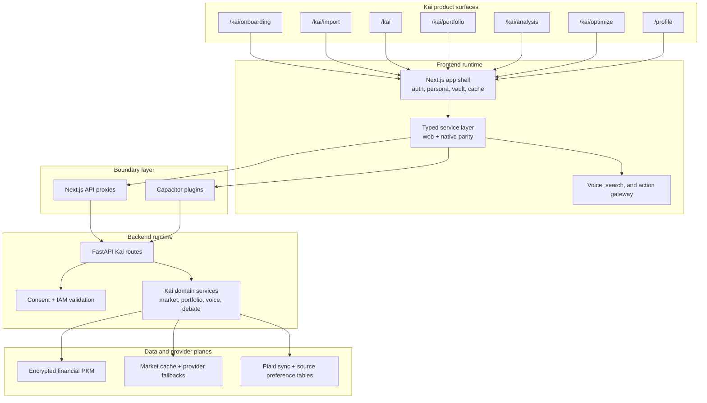

# Kai Architecture Specification v1

Status: canonical current-state architecture specification for Kai as implemented and documented in this repository on April 22, 2026.

## Visual Map

## Purpose

This document gives one current-state architecture narrative for Kai across:

- product surfaces
- trust and consent boundaries
- frontend and backend runtime ownership
- voice, search, and actionability
- brokerage connectivity and portfolio analysis
- current verification and non-current boundaries

Use this document when a founder, operator, or contributor needs the repo-backed Kai architecture in one place. Use the linked subsystem references for deeper implementation detail.

## Founder Language Mapping

This document uses founder language first while staying current-state correct:

- `Kai` is the platform's user-facing intelligence surface, not a separate runtime from the rest of the repo
- `PCHP` is implemented today through the Consent Protocol developer API + MCP consent/export flow that Kai presents for approval
- `Capability Tokens` are implemented today as `VAULT_OWNER`, consent tokens, scoped tokens, and developer tokens
- `Cryptographic Primitives` are implemented today through BYOK, encrypted PKM, wrapped export keys, and local key derivation
- `Separation of Duties` is implemented today through the frontend/backend boundary plus the web-proxy/native-plugin split
- `Tamper-Evident History` is implemented today through audit rows, export revisions, and verification artifacts; Merkle-sealed history is not a current-state claim

## Source Basis

This spec is grounded in the checked-in docs and runtime contracts, especially:

- [../../project_context_map.md](../../project_context_map.md)
- [../architecture/architecture.md](../architecture/architecture.md)
- [../iam/architecture.md](../iam/architecture.md)
- [./kai-interconnection-map.md](./kai-interconnection-map.md)
- [./kai-voice-runtime-architecture.md](./kai-voice-runtime-architecture.md)
- [./kai-action-gateway-vnext.md](./kai-action-gateway-vnext.md)
- [./kai-brokerage-connectivity-architecture.md](./kai-brokerage-connectivity-architecture.md)
- [./kai-accuracy-contract.md](./kai-accuracy-contract.md)
- [./kai-runtime-smoke-checklist.md](./kai-runtime-smoke-checklist.md)
- [./kai-change-impact-matrix.md](./kai-change-impact-matrix.md)

## Executive Summary

Kai today is an integrated investor product surface and runtime spanning:

1. signed-in route surfaces in `hushh-webapp`
2. a typed frontend service and cache layer that preserves web/iOS/Android parity
3. a PCHP-backed backend runtime in `consent-protocol`
4. encrypted PKM-backed portfolio and profile state
5. a generated action plane that unifies voice, search, and UI actionables

Kai is not currently implemented as a separate Kai/Nav dual-process security architecture. The checked-in system instead enforces trust through Cryptographic Primitives, vault-gated encrypted data access, Capability Tokens, persona and route guards, typed service boundaries, and explicit fail-closed behavior on decision-critical paths.

## Product Surface Model

The current Kai route map is intentional and stable unless route governance changes:

- `/kai/onboarding`: canonical onboarding and persona capture
- `/kai/import`: statement upload, brokerage connect, and first portfolio setup
- `/kai/plaid/oauth/return`: Plaid OAuth resume surface
- `/kai`: signed-in live market home
- `/kai/portfolio`: holdings, analytics, and dashboard views
- `/kai/analysis`: debate stream and decision views
- `/kai/optimize`: optimization workflow
- `/profile`: profile and adjacent user settings surfaces that also publish Kai actionability

Current route invariants:

- incomplete onboarding does not bypass into non-onboarding Kai routes
- vault unlock is required only when protected data or mutations need it
- market home remains cache-first while data is fresh
- degraded provider states must be explicit, not silently hidden

## Runtime Architecture

### Frontend Runtime

The frontend runtime lives in `hushh-webapp` and owns:

- route rendering and signed-in shell behavior
- auth, persona, vault, and cache contexts
- typed service calls instead of component-level `fetch()`
- the web path through Next.js API proxies
- the native path through Capacitor plugins
- the live voice, search, and command execution experience

The frontend is also the user-side trust boundary for unlocked encrypted data. Sensitive vault material and decrypted PKM stay memory-first rather than becoming general browser storage.

### Backend Runtime

The backend runtime lives in `consent-protocol` and owns:

- FastAPI route contracts for market, portfolio, Plaid, analysis, and voice
- consent and IAM validation before protected access
- PKM writes and metadata reconciliation
- market insight aggregation and cache policy
- debate orchestration and streaming
- voice planning, composition, and manifest loading

The backend persists workflow state, encrypted blobs, sanitized metadata, and provider-backed caches. It should not become a plaintext personal-memory store.

### Data And Persistence Planes

Kai currently depends on three primary data planes:

### 1. Encrypted personal financial context

- encrypted `financial` domain data in PKM
- onboarding/profile state aligned with encrypted profile fields
- sanitized metadata and summary projections in `pkm_index`

### 2. Market and analysis support data

- backend market cache tiers for home and analysis context
- external quote, news, and fundamentals providers with explicit fallback order
- degraded-state signaling when realtime dependencies are partial

### 3. Brokerage connectivity data

- server-side Plaid item and refresh tables
- source preference rows
- short-lived OAuth resume sessions

Plaid tokens do not live in the PKM, and the active portfolio source determines the app-consumed portfolio shape.

## Voice, Search, And Action Architecture

Kai voice is an in-app assistant runtime, not a separate external assistant.

The current actionability model is contract-first:

1. local `.voice-action-contract.json` files define discoverable capability existence
2. the gateway generator emits `contracts/kai/kai-action-gateway.vnext.json`
3. frontend and backend load that gateway through adapters
4. voice, typed search, UI actionables, analytics, and docs share one stable `action_id`

Current runtime loop:

1. user speaks or types
2. frontend builds structured screen and runtime context
3. backend `/voice/plan` returns canonical planner fields
4. frontend grounds and executes the canonical `action_id`
5. runtime waits for settlement where needed
6. backend `/voice/compose` or deterministic fallback produces final speech

Important current constraints:

- Kai voice is English-only: STT/realtime transcription are pinned to `en`, planner/composer prompts require English-only responses, and TTS receives English-only speech instructions.
- runtime metadata describes current screen state, not capability existence
- transcript heuristics are compatibility fallback, not the desired authority plane
- durable voice memory remains encrypted and vault-gated
- persona, workspace, auth, consent, and onboarding guards remain central preconditions

## Brokerage, Portfolio, And Analysis Architecture

Kai currently supports two real portfolio acquisition paths plus one derived comparison view:

- `Statement`: editable imported data
- `Plaid`: read-only brokerage-backed data
- `Combined`: comparison-only summary, not a direct decision source

Current brokerage model:

- statement import writes validated portfolio data into encrypted financial PKM
- Plaid handles holdings, accounts, transactions, refresh, and OAuth resume
- active source selection drives the portfolio, analysis, and optimize surfaces
- sync freshness and provenance remain explicit in the UI

Current decision and analysis model:

- `/kai` provides cache-first market intelligence and market-home context
- `/kai/analysis` uses streamed debate output and explicit degraded markers
- `/kai/optimize` fails closed when decision-critical realtime dependencies are unavailable
- every dashboard KPI and decision-critical claim must map back to explicit provenance

## Trust And Security Model

The current checked-in Kai trust model is defined by repo-wide invariants rather than a separate Nav runtime.

Core current invariants:

- Cryptographic Primitives: the user-controlled key boundary stays on the user side
- Capability Tokens + PCHP: private data access requires valid scope and token checks
- ciphertext at rest: backend persists ciphertext and metadata, not plaintext private memory
- minimal browser storage: sensitive credentials and decrypted data stay memory-only where required
- Separation of Duties: web, iOS, and Android stay aligned through the service layer and route contracts

Current enforcement layers:

- route and persona guards in the frontend
- `VAULT_OWNER` token guard for protected Kai data fetches
- backend consent and scope validation
- vault-gated PKM access
- explicit accuracy and degraded-state contracts for market and analysis behavior

## Verification And Governance

Kai already has explicit current-state verification surfaces:

- [kai-accuracy-contract.md](./kai-accuracy-contract.md): decision-critical data and fail-closed expectations
- [kai-runtime-smoke-checklist.md](./kai-runtime-smoke-checklist.md): runtime verification path
- [kai-change-impact-matrix.md](./kai-change-impact-matrix.md): blast-radius and rollback guidance
- [kai-route-audit-matrix.md](./kai-route-audit-matrix.md): route-level audit mapping
- [mobile-kai-parity-map.md](./mobile-kai-parity-map.md): mobile parity expectations

These documents are part of the architecture, not ancillary paperwork. Kai's runtime claims should stay bounded by what these checks can actually verify.

## Present State, Honestly Stated

The repo today does not implement several properties that might appear in a future Kai/Nav constitution-level architecture:

- no separate Nav signing process or hardware-isolated policy runtime
- no checked-in Merkle-root audit log for all consent-bearing Kai actions
- no threshold-signature or duress-code execution path
- no biscuit/macaroon-style capability-token layer as the canonical Kai authority plane
- no broker trade execution or auto-trading path

What the repo does implement today is narrower but real:

- consent-scoped access
- Cryptographic Primitives and encrypted PKM boundaries
- typed service and route contracts
- explicit voice/search/action identity through the generated gateway
- cache, provider, and degraded-mode rules for investor-facing reliability

## Related References

- [README.md](./README.md)
- [kai-interconnection-map.md](./kai-interconnection-map.md)
- [kai-voice-runtime-architecture.md](./kai-voice-runtime-architecture.md)
- [kai-action-gateway-vnext.md](./kai-action-gateway-vnext.md)
- [kai-brokerage-connectivity-architecture.md](./kai-brokerage-connectivity-architecture.md)
- [kai-accuracy-contract.md](./kai-accuracy-contract.md)
- [kai-runtime-smoke-checklist.md](./kai-runtime-smoke-checklist.md)
- [kai-change-impact-matrix.md](./kai-change-impact-matrix.md)

## Provenance

This current-state specification was prepared after reconciling the founder input in `tmp/Kai Nav Architecture Spec v1.docx` against the checked-in Kai architecture, IAM, trust, voice, brokerage, and verification docs in the repository.
